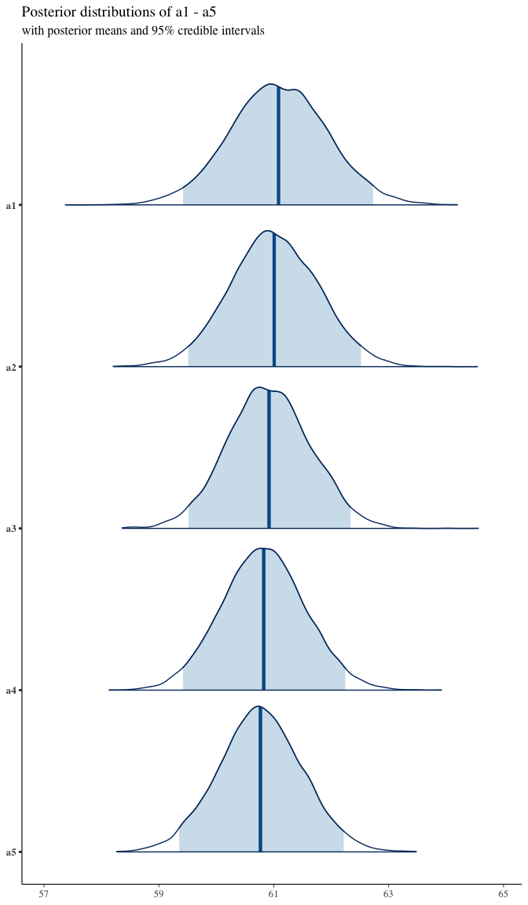

<!-- README.md is generated from README.Rmd. Please edit that file -->

# SpatialGEV

<!-- badges: start -->

[](https://cran.r-project.org/package=SpatialGEV)
[](https://github.com/meixichen/SpatialGEV/actions)
<!-- badges: end -->

*Meixi Chen, Martin Lysy, Reza Ramezan*

------------------------------------------------------------------------

## Description

A fast Bayesian inference method for spatial random effects modelling of
weather extremes. The latent spatial variables are efficiently
marginalized by a Laplace approximation using the
[***TMB***](https://github.com/kaskr/adcomp) library, which leverages
efficient automatic differentiation in C++. The models are compiled in
C++, whereas the optimization step is carried out in R. With this
package, users can fit spatial GEV models with different complexities to
their dataset without having to formulate the model using C++. This
package also offers a method to sample from the approximate posterior
distributions of both fixed and random effects, which will be useful for
downstream analysis.

## Installation

Before installing ***SpatialGEV***, make sure you have ***TMB***
installed following the instructions
[here](https://github.com/kaskr/adcomp/wiki/Download).

***SpatialGEV*** uses several functions from the ***INLA*** package for
SPDE approximation to the Matérn covariance as well as mesh creation on
the spatial domain. If the user would like to use the SPDE method
(i.e. `kernel="spde"` in `spatialGEV_fit()`), please first install
package ***INLA***. Since ***INLA*** is not on CRAN, it needs to be
downloaded following their instruction
[here](https://www.r-inla.org/download-install).

To download the stable version of this package, run

``` r
install.packages("SpatialGEV")
```

To download the development version of this package, run

``` r
devtools::install_github("meixichen/SpatialGEV")
```

## Example

Using the simulated data set `simulatedData2` provided in the package,
we demonstrate how to use this package. Spatial variation of the GEV
parameters are plotted below.

``` r
library(SpatialGEV)
# GEV parameters simulated from Gaussian random fields
a <- simulatedData2$a # location
logb <- simulatedData2$logb # log scale
logs <- simulatedData2$logs # log shape
locs <- simulatedData2$locs # coordinate matrix
n_loc <- nrow(locs) # number of locations
y <- Map(evd::rgev,
  n = sample(50:70, n_loc, replace = TRUE),
  loc = a, scale = exp(logb), shape = exp(logs)
) # observations

filled.contour(
  x = unique(locs$x),
  y = unique(locs$y),
  z = matrix(a, ncol = sqrt(n_loc)),
  color.palette = terrain.colors,
  xlab = "Longitude", ylab = "Latitude",
  main = "Spatial variation of a",
  cex.lab = 1, cex.axis = 1
)
```


``` r

filled.contour(
  x = unique(locs$x),
  y = unique(locs$y),
  z = matrix(exp(logb), ncol = sqrt(n_loc)),
  color.palette = terrain.colors,
  xlab = "Longitude", ylab = "Latitude",
  main = "Spatial variation of b",
  cex.lab = 1, cex.axis = 1
)
```


``` r

filled.contour(
  x = unique(locs$x),
  y = unique(locs$y),
  z = matrix(exp(logs), ncol = sqrt(n_loc)),
  color.palette = terrain.colors,
  xlab = "Longitude", ylab = "Latitude",
  main = "Spatial variation of s",
  cex.lab = 1, cex.axis = 1
)
```


To fit a GEV-GP model to the simulated data, use the `spatialGEV_fit()`
function. We use `random="abs"` to indicate that all three GEV
parameters are treated as random effects. The shape parameter `s` is
constrained to be positive (log transformed) by specifying
`reparam_s="positive"`. The covariance kernel function used here is the
SPDE-approximated Matérn kernel `kernel="spde"`. Initial parameter
values are passed to `init_param` using a list.

``` r
fit <- spatialGEV_fit(
  data = y, locs = locs, random = "abs",
  init_param = list(
    a = rep(60, n_loc),
    log_b = rep(2, n_loc),
    s = rep(-3, n_loc),
    beta_a = 60, beta_b = 2, beta_s = -2,
    log_sigma_a = 1.5, log_kappa_a = -2,
    log_sigma_b = 1.5, log_kappa_b = -2,
    log_sigma_s = -1, log_kappa_s = -2
  ),
  reparam_s = "positive",
  kernel = "spde",
  silent = TRUE
)

class(fit)
#> [1] "spatialGEVfit"
print(fit)
#> Model fitting took 16.8532750606537 seconds 
#> The model has reached relative convergence 
#> The model uses a spde kernel 
#> Number of fixed effects in the model is 9 
#> Number of random effects in the model is 1308 
#> Hessian matrix is positive definite. Use spatialGEV_sample to obtain posterior samples
```

Posterior samples of the random and fixed effects are drawn using
`spatialGEV_sample()`. Specify `observation=TRUE` if we would also like
to draw from the posterior predictive distribution.

``` r
sam <- spatialGEV_sample(model = fit, n_draw = 1e4, observation = TRUE)
print(sam)
#> The samples contain 10000 draws of 1209 parameters 
#> The samples contain 10000 draws of response at 400 locations 
#> Use summary() to obtain summary statistics of the samples
```

To get summary statistics of the posterior samples, use `summary()` on
the sample object.

``` r
pos_summary <- summary(sam)
pos_summary$param_summary[1:5, ]
#>        2.5%      25%      50%      75%    97.5%     mean
#> a1 59.25026 60.40500 61.00427 61.62747 62.77069 61.01379
#> a2 59.48056 60.54463 61.11959 61.68137 62.73596 61.11448
#> a3 59.48051 60.46909 60.97925 61.49504 62.45936 60.97861
#> a4 59.21269 60.20313 60.73353 61.25842 62.22433 60.72580
#> a5 58.79040 59.85486 60.45759 61.05277 62.13024 60.45854
pos_summary$y_summary[1:5, ]
#>        2.5%      25%      50%      75%    97.5%     mean
#> y1 39.40958 55.14766 67.50013 83.91931 139.5049 72.83111
#> y2 38.93668 55.55349 68.17977 85.45240 139.8687 73.54768
#> y3 38.40468 55.14562 68.31470 86.16494 143.2262 73.79189
#> y4 37.37779 54.84899 67.84350 86.21062 141.1534 73.42529
#> y5 35.48020 54.17413 67.58432 86.12147 140.6352 73.03575
```

One can also plot the full posteriors using e.g., the
[***bayespolot***](https://mc-stan.org/bayesplot/) package.

``` r
library(bayesplot)
#> This is bayesplot version 1.11.1
#> - Online documentation and vignettes at mc-stan.org/bayesplot
#> - bayesplot theme set to bayesplot::theme_default()
#>    * Does _not_ affect other ggplot2 plots
#>    * See ?bayesplot_theme_set for details on theme setting
library(ggplot2)
mcmc_areas(
  x = sam$parameter_draws[, 1:5],
  prob = .95,
  point_est = "mean"
) +
  ggtitle(
    "Posterior distributions of a1 - a5",
    "with posterior means and 95% credible intervals"
  )
```



# TODO

- [ ] Consider a shorter name, e.g., `sgev_*`, than `spatialGEV_*`.

- [ ] Argument `init_params` adds a lot of complexity to
  `spatialGEV_fit()`. Perhaps this function can be broken down into two
  parts: `spatialGEV_adfun()` which returns the `adfun` object, and then
  `spatialGEV_fit()` which does the fitting. The advantage is that the
  `adfun$env$parameters` object tells you the dimension of the parameter
  values, which can be useful for initialization. Also, note that
  `adfun$env$data` object contains the entire data list for browsing.

- [ ] Write some tests for the `spde` kernel. Construct the sparse
  precision matrix using `get_spde_prec()`, invert it using
  `Matrix::solve()`, apply the scale factor, and pass as variance to
  `dmvnorm()`.
