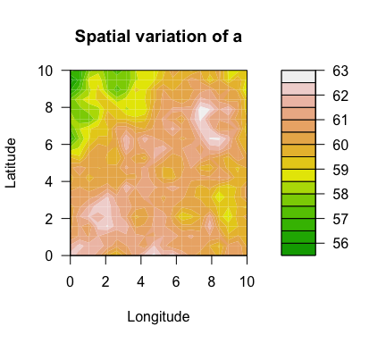
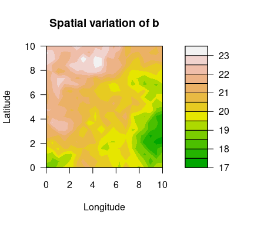
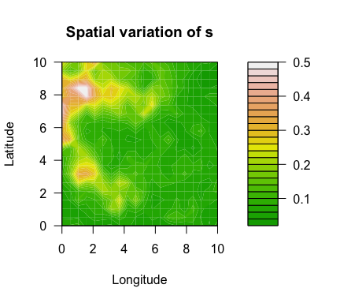

<!-- README.md is generated from README.Rmd. Please edit that file -->

# SpatialGEV

<!-- badges: start -->
<!-- badges: end -->

*Meixi Chen, Martin Lysy*

------------------------------------------------------------------------

## Description

A fast Bayesian inference method for spatial random effects modelling of
weather extremes. The latent spatial variables are efficiently
marginalized by a Laplace approximation using the
[***TMB***](https://github.com/kaskr/adcomp) library, which leverages
efficient automatic differentiation in C++. The models are compiled in
C++, whereas the optimization step is carried out in R. With this
package, users can fit spatial GEV models with different complexities to
their dataset without having to formulate the model using C++. This
package also offers a method to sample from the approximate posterior
distributions of both fixed and random effects, which will be useful for
downstream analysis.

## Installation

Before installing ***SpatialGEV***, make sure you have ***TMB***
installed following the instructions
[here](https://github.com/kaskr/adcomp/wiki/Download).

***SpatialGEV*** uses several functions from the ***INLA*** package for
SPDE approximation to the Matérn covariance as well as mesh creation on
the spatial domain. If the user would like to use the SPDE method
(i.e. `kernel="spde"` in `spatialGEV_fit()`), please first install
package ***INLA***. Since ***INLA*** is not on CRAN, it needs to be
downloaded following their instruction
[here](https://www.r-inla.org/download-install).

To download the development version of this package, run

``` r
devtools::install_github("meixichen/SpatialGEV")
```

## Example

Using the simulated data set `simulatedData2` provided in the package,
we demonstrate how to use this package. Spatial variation of the GEV
parameters are plotted below.

``` r
library(SpatialGEV)
# GEV parameters simulated from Gaussian random fields
a <- simulatedData2$a # location
logb <- simulatedData2$logb # log scale
logs <- simulatedData2$logs # log shape
locs <- simulatedData2$locs # coordinate matrix
n_loc <- nrow(locs) # number of locations
y <- Map(evd::rgev, n=sample(50:70, n_loc, replace=TRUE),
         loc=a, scale=exp(logb), shape=exp(logs)) # observations

filled.contour(unique(locs$x), unique(locs$y), matrix(a, ncol=sqrt(n_loc)), 
               color.palette = terrain.colors, xlab="Longitude", ylab="Latitude", 
               main="Spatial variation of a",
               cex.lab=1,cex.axis=1)
```



``` r
filled.contour(unique(locs$x), unique(locs$y), matrix(exp(logb), ncol=sqrt(n_loc)), 
               color.palette = terrain.colors, xlab="Longitude", ylab="Latitude", 
               main="Spatial variation of b",
               cex.lab=1,cex.axis=1)
```



``` r
filled.contour(unique(locs$x), unique(locs$y), matrix(exp(logs), ncol=sqrt(n_loc)),
               color.palette = terrain.colors, xlab="Longitude", ylab="Latitude",
               main="Spatial variation of s",
               cex.lab=1,cex.axis=1)
```



To fit a GEV-GP model to the simulated data, use the `spatialGEV_fit()`
function. We use `random="abs"` to indicate that all three GEV
parameters are treated as random effects. The shape parameter `s` is
constrained to be positive (log transformed) by specifying
`reparam_s="positive"`. The covariance kernel function used here is the
exponential kernel `kernel="exp"`. Initial parameter values are passed
to `init_param` using a list.

``` r
fit <- spatialGEV_fit(y = y, locs = locs, random = "abs",
                      init_param = list(a = rep(60, n_loc),
                                        log_b = rep(2,n_loc),
                                        s = rep(-3,n_loc),
                                        beta_a = 60, beta_b = 2, beta_s = -2,
                                        log_sigma_a = 1.5, log_ell_a = 5,
                                        log_sigma_b = 1.5, log_ell_b = 5,
                                        log_sigma_s = -1, log_ell_s = 5),
                      reparam_s = "positive", kernel="exp", silent = T)

class(fit)
#> [1] "spatialGEVfit"
print(fit)
#> Model fitting took 174.714142560959 seconds 
#> The model has reached relative convergence 
#> The model uses a exp kernel 
#> Number of fixed effects in the model is 9 
#> Number of random effects in the model is 1200 
#> Hessian matrix is positive definite. Use spatialGEV_sample to obtain posterior samples
```

Posterior samples of the random and fixed effects are drawn using
`spatialGEV_sample()`. Specify `observation=TRUE` if we would also like
to draw from the posterior predictive distribution.

``` r
sam <- spatialGEV_sample(model = fit, n_draw = 2000, observation = T)
print(sam)
#> The samples contains 2000 draws of 1209 parameters 
#> The samples contains 2000 draws of response at 400 locations 
#> Use summary() to obtain summary statistics of the samples
```

To get summary statistics of the posterior samples, use `summary()` on
the sample object.

``` r
pos_summary <- summary(sam)
pos_summary$param_summary[1:5,]
#>        2.5%      25%      50%      75%    97.5%     mean
#> a1 58.53086 59.77593 60.38428 61.01913 62.18773 60.39375
#> a2 58.61986 59.71741 60.27881 60.80942 61.88439 60.25487
#> a3 58.43086 59.57399 60.15292 60.70487 61.73008 60.13191
#> a4 58.13659 59.21796 59.74732 60.34869 61.39179 59.77277
#> a5 57.67409 58.84051 59.48342 60.11202 61.22805 59.47090
pos_summary$y_summary[1:5,]
#>        2.5%      25%      50%      75%    97.5%     mean
#> y1 37.12727 54.72752 67.57171 84.51912 139.0746 72.49402
#> y2 36.68054 54.00466 67.17315 86.66181 138.6378 72.92259
#> y3 35.94104 53.06463 67.11551 85.54396 144.7266 72.79682
#> y4 36.44413 54.48533 67.84922 85.58373 140.1069 73.04688
#> y5 34.02216 52.88473 65.74329 83.69758 137.8215 71.23010
```
