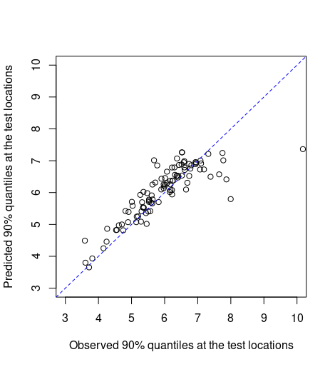

<script type="text/x-mathjax-config">
MathJax.Hub.Config({
  TeX: { equationNumbers: { autoNumber: "AMS" } }
});
</script>

\newcommand{\bm}[1]{\boldsymbol{#1}}
\newcommand{\tx}[1]{\mathrm{#1}}
\newcommand{\xx}{{\bm{x}}}
\newcommand{\yy}{{\bm{y}}}
\newcommand{\XX}{{\bm{X}}}
\newcommand{\YY}{{\bm{Y}}}
\newcommand{\ZZ}{{\bm{Z}}}
\newcommand{\tth}{{\bm{\theta}}}
\newcommand{\pps}{{\bm{\psi}}}
\newcommand{\uu}{{\bm{u}}}
\newcommand{\SSi}{{\bm{\Sigma}}}
\newcommand{\VV}{{\bm{V}}}
\newcommand{\iid}{{\overset{iid}{\sim}}}

# Summary

Extreme weather phenomena such as floods and hurricanes are of great concern due to their potential to cause extensive damage. To develop more reliable damage prevention protocols, statistical models are often used to infer the chance of observing an extreme weather event at a given location [@coles98; @cooley07; @sang-gelfand10]. Here we present `SpatialGEV`, an R package providing a fast and convenient toolset for analyzing spatial extreme values using a hierarchical Bayesian modeling framework. In this framework, the marginal behavior of the extremes is given by a generalized extreme value (GEV) distribution, whereas the spatial dependence between locations is captured by modeling the GEV parameters as spatially varying random effects following a Gaussian process (GP). Users are provided with a streamlined way to build and fit various GEV-GP models in R, which are compiled in C++ under the hood. For downstream analyses, the package offers methods for Bayesian parameter estimation and forecasting of extreme events. 

# Statement of need

The GEV-GP model has important applications in meteorological studies. For example, let $y=y(\xx)$ denote the amount of rainfall at a spatial location $\xx$. To forecast extreme rainfalls, it is often of interest for meteorologists to estimate the $1/p$-year rainfall return value $z_p(\xx)$, which is the value above which precipitation levels at location $\xx$ occur with probability $p$, i.e.,
\begin{equation}
\Pr\big(y(\xx) > z_p(\xx)\big) = 1-F_{y\mid \xx}\big(z_p(\xx)\big) = p,
\label{eq:return-level}
\end{equation}
where the CDF is that of the GEV distribution specific to location $\xx$. The value $r=1/p$ is known as the return period. When $p$ is chosen to be a small value, $z_p(\xx)$ indicates how extreme the precipitation level might be at location $\xx$. 

In a Bayesian context, the posterior distribution $p(z_p(\xx)\mid \yy)$, where $\yy=(\yy(\xx_1), \ldots, \yy(\xx_n))$ represents rainfall measurements at $n$ different locations, is very useful for forecasting extreme weather events. Traditionally, Markov Chain Monte Carlo (MCMC) methods are used to sample from the posterior distribution of the GEV model [e.g., @cooley07; @schliep10; @dyrrdal15]. However, this can be extremely computationally intensive when the number of locations is large. The `SpatialGEV` package implements Bayesian inference based on the Laplace approximation as an alternative to MCMC, making large-scale spatial analyses orders of magnitude faster while achieving roughly the same accuracy as MCMC. The Laplace approximation is carried out using the R/C++ package `TMB` [@kristensen16]. Details of the inference method can be found in @chen-etal21. 


# Statement of field

The R package `SpatialExtremes` [@spatialextremes] is one of the most popular software for fitting spatial extreme value models, which employs an efficient Gibbs sampler. The Stan programming language and its R interface `RStan` [@rstan] provides off-the-shelf implementations for Hamiltonian Monte Carlo and its variants [@neal11; @hoffman-gelman14], which are considered state-of-the-art MCMC algorithms and often used for fitting hierarchical spatial models. @chen-etal21 compares the speed and accuracy of the Laplace method implemented in `SpatialGEV` to `RStan`. It is found that `SpatialGEV` is three orders of magnitude faster than `RStan`. A well-known alternative to MCMC is the `R-INLA` package [@lindgren-rue15] which implements the integrated nested Laplace approximation (INLA) approach. As an extension of the Laplace approximation, INLA is often considerably more accurate. However, the INLA methodology is inapplicable to GEV-GP models in which two or more GEV parameter are modeled as random effects following different Gaussian processes. Moreover, the `R-INLA` implementation of the GEV-GP model only allows the GEV location parameter to be random. In contrast, `SpatialGEV` offers more flexibility as it is straightforward for the user to choose what GEV parameters are spatial random effects.

# Example

## Model fitting
The main functions of the `SpatialGEV` package are `spatialGEV_fit()`, `spatialGEV_sample()`, and `spatialGEV_predict()`. This example shows how to apply these functions to analyze a simulated dataset using the GEV-GP model. The spatial domain is a $20\times 20$ regular lattice on $[0, 10] \times [0,10] \subset \mathbb{R}^2$, such that there are $n=400$ locations in total. The GEV location parameter $a(\xx)$ and the scale parameter $b(\xx)$ are generated from surfaces depicted in Figure \ref{fig:sim-par}, whereas the shape parameter $s$ is a constant $exp(-2)$ across space. 10 to 30 observations per location are simulated from the GEV distribution conditional on the GEV parameters $(a(\xx), b(\xx), s)$. The simulated data is provided by the package as a list called `simulatedData`.

\begin{figure}[h]
\centering
\begin{subfigure}{.4\textwidth}
\includegraphics[]{sim-plot-a.png}
\end{subfigure}%
\begin{subfigure}{.4\textwidth}
\includegraphics[]{sim-plot-b.png}
\end{subfigure}
\caption{The simulated GEV location parameters $a(\xx_i)$ and scale parameters $(b(\xx_i))$ plotted on regular lattices.}\label{fig:sim-par}
\end{figure}

The GEV-GP model is fitted by calling `spatialGEV_fit()`. By specifying `random="ab"`, only the GEV parameters $a$ and $b$ are considered spatial random effects. Initial parameter values are passed to `init_param`, where `log_sigma_{a/b}` and `log_ell_{a/b}` are hyperparameters in the GP exponential kernel functions, and `beta_{a/b}` are regression coefficients in the GP mean function. The GP kernel function is chosen using `kernel="exp"`. Other kernel function options are the Matérn kernel and the SPDE approximation to the Matérn described in @lindgren-etal11. The argument `reparam_s="positive"` means we constrain the shape parameter to be positive, i.e., its estimation is done on the log scale. Covariates to include in the mean functions can be provided in a matrix form to `X_{a/b}`. In this example, we only include the intercepts. The posterior mean estimates of the spatial random effects can be accessed from `mod_fit$report$par.random`, whereas the fixed effects can be obtained from `mod_fit$report$par.fixed`.

```r
set.seed(123)                      # set seed for reproducible results
library(SpatialGEV)                # load package
locs <- simulatedData$locs         # location coordinates
n_loc <- nrow(locs)                # number of locations
a <- simulatedData$a               # true GEV location parameters
logb <- simulatedData$logb         # true GEV (log) scale parameters
logs <- simulatedData$logs         # true GEV (log) shape parameter
y <- simulatedData$y               # simulated observations
# Model fitting
fit <- spatialGEV_fit(y = y, locs = locs, random = "ab",
                      init_param = list(a = rep(4, n_loc),
                                        log_b = rep(0,n_loc),
                                        s = -2,
                                        beta_a = 4, beta_b = 0,
                                        log_sigma_a = 0, log_ell_a = 1,
                                        log_sigma_b = 0, log_ell_b = 1),
                      reparam_s = "positive", kernel="exp",
                      X_a = matrix(1, nrow=n_loc, ncol=1),
                      X_b = matrix(1, nrow=n_loc, ncol=1),
                      silent=T)                
print(fit)
#> Model fitting took 63.9106986522675 seconds 
#> The model has reached relative convergence 
#> The model uses a exp kernel 
#> Number of fixed effects in the model is 7 
#> Number of random effects in the model is 800 
#> Hessian matrix is positive definite. Use spatialGEV_sample to obtain posterior samples 
```

## Sampling from the joint posterior
Now, we show how to sample 2000 times from the joint posterior distribution of the GEV parameters using the function `spatialGEV_sample()`. Only three arguments need to be passed to this function: `model` takes in the list output by `spatialGEV_fit()`, `n_draw` is the number of samples to draw from the posterior distribution, and `observation` indicates whether to draw from the posterior predictive distribution of the data at the observed locations. Call `summary()` on the sample object to obtain summary statistics of the posterior samples.

```r
sam <- spatialGEV_sample(model = fit, n_draw = 2000, observation = T)
print(sam)
#> The samples contains 2000 draws of 807 parameters 
#> The samples contains 2000 draws of response at 400 locations 
#> Use summary() to obtain summary statistics of the samples
pos_summary <- summary(sam)
```

The samples are then used to calculate the posterior mean estimate of the 10-year return level $z_{10}(\xx)$ at each location, which are plotted against their true values in Figure \ref{fig:sim-return-level}.
```r
library(evd)
# True return levels
z_true <- unlist(Map(evd::qgev, p=0.1, loc=a, scale=exp(logb),
              shape=exp(logs), lower.tail=F))
# Posterior samples of return levels at all locations
return_period <- 10 
z_draws <- apply(sam$parameter_draws, 1,
                 function(all_draw){
                 mapply(evd::qgev, p=1/return_period, 
                        loc=all_draw[paste0("a", 1:n_loc)], 
                        scale=exp(all_draw[paste0("log_b", 1:n_loc)]),
                        shape=exp(all_draw["s"]), 
                        lower.tail=F)
                 })
z_mean <- apply(z_draws, 1, mean)
plot(z_true, z_mean, xlab="True 10-year return levels", 
     ylab="Posterior mean estimates of 10-year return levels")
abline(0, 1, lty="dashed", col="blue")
```

{width=45%}

## Prediction at new locations
Next, we show how to predict the values of the extreme event at test locations. First, we divide the simulated dataset into training and test sets, and fit the model to the training dataset. We can simulate from the posterior predictive distribution of observations at the test locations using the `spatialGEV_predict()` function, which requires the fitted model to the training data passed to `model`, a matrix of the coordinates of the test locations passed to `locs_new`, and the number of simulation draws passed to `n_draw`. Figure \ref{fig:sim-pred} plots the 90\% quantile values of the posterior predictive distributions against the 90\% quantile values of the observations at all test locations.

```
set.seed(123)
n_test <- 100                        # number of test locations
test_ind <- sample(1:400, n_test)    # indices of the test locations
locs_test <- locs[test_ind,]         # coordinates of the test locations
y_test <- y[test_ind]                # observations at the test locations
locs_train <- locs[-test_ind,]       # coordinates of the training locations
y_train <- y[-test_ind]              # observations at the training locations

# Fit the GEV-GP model to the training set
train_fit <- spatialGEV_fit(y = y_train, locs = locs_train, random = "ab", 
                            init_param = list(a = a[-test_ind], 
                                              log_b = logb[-test_ind], 
                                              s = -2,
                                              beta_a = 60, beta_b = 2,
                                              log_sigma_a = 0, log_ell_a = 1,
                                              log_sigma_b = 0, log_ell_b = 1),
                            reparam_s = "positive", kernel="exp", silent=T)
                          
# Make predictions at the test locations
pred <- spatialGEV_predict(model = train_fit, locs_new = locs_test, 
                           n_draw = 2000)
```

{width=45%}

# Acknowledgements

This work was supported by the Natural Sciences and Engineering Research Council of Canada, grant numbers RGPIN-2018-04376 (Ramezan), DGECR-2018-00349 (Ramezan) and RGPIN-2020-04364 (Lysy).

# References
