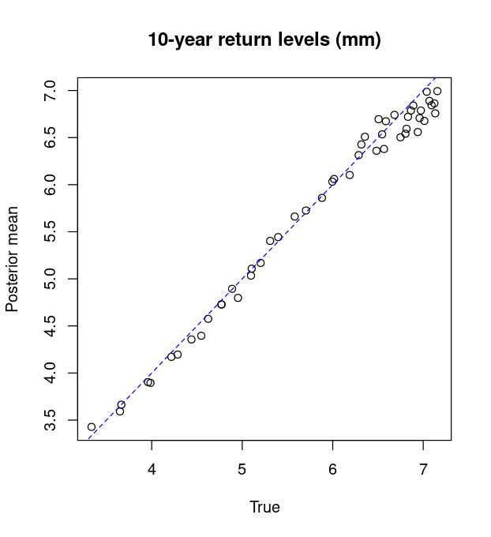

<script type="text/x-mathjax-config">
MathJax.Hub.Config({
  TeX: { equationNumbers: { autoNumber: "AMS" } }
});
</script>

\newcommand{\bm}[1]{\boldsymbol{#1}}
\newcommand{\tx}[1]{\mathrm{#1}}
\newcommand{\xx}{{\bm{x}}}
\newcommand{\yy}{{\bm{y}}}
\newcommand{\XX}{{\bm{X}}}
\newcommand{\YY}{{\bm{Y}}}
\newcommand{\ZZ}{{\bm{Z}}}
\newcommand{\tth}{{\bm{\theta}}}
\newcommand{\pps}{{\bm{\psi}}}
\newcommand{\uu}{{\bm{u}}}
\newcommand{\SSi}{{\bm{\Sigma}}}
\newcommand{\VV}{{\bm{V}}}
\newcommand{\iid}{{\overset{\mathrm{iid}}{\sim}}}

# Summary

Extreme weather phenomena such as floods and hurricanes are of great concern due to their potential to cause extensive damage. To develop more reliable damage prevention protocols, statistical models are often used to infer the chance of observing an extreme weather event at a given location [@coles98; @cooley07; @sang-gelfand10]. Here we present **SpatialGEV**, an \textsf{R} package providing a fast and convenient toolset for analyzing spatial extreme values using a hierarchical Bayesian modeling framework. In this framework, the marginal behavior of the extremes is given by a generalized extreme value (GEV) distribution, whereas the spatial dependence between locations is captured by modeling the GEV parameters as spatially varying random effects following a Gaussian process (GP). Model inference is carried out using an efficient implementation of the Laplace approximation, which produces highly accurate posterior estimates several orders of magnitude faster than Markov Chain Monte Carlo (MCMC) methods. Users are provided with a streamlined way to build and fit various GEV-GP models in \textsf{R}, which are compiled in \textsf{C++} under the hood. For downstream analyses, the package offers methods for Bayesian parameter estimation and forecasting of extreme events. 

# Background

Let $y_{ij}$ denote observation $j$ of an extreme weather event at spatial location $i$, of which the two-dimensional spatial coordinates are $\xx_i$. The general form of the GEV-GP models that can be fit using **SpatialGEV** is
\begin{equation}
\begin{aligned}
  y_{ij} &\iid \operatorname{GEV}(a(\xx_i), \exp(b(\xx_i)), s(\xx_i)),\\
  u(\xx) &\sim \operatorname{GP}(\bm{c}_u(\xx)^T\bm{\beta}_u(\xx), \ \mathcal{K}(\xx,\xx' \mid \bm{\eta}_u)),
\end{aligned}
\end{equation}
where $\operatorname{GEV}(a, b, s)$ denotes a GEV distribution with location parameter $a$, positive scale parameter $b$ and shape parameter $s$,
$\operatorname{GP}(\mu(\xx), \mathcal{K}(\xx,\xx'))$ is a Gaussian process with mean function $\mu(\xx)$ and covariance kernel $\mathcal{K}(\xx,\xx')$, and $u\in\{a,b,s\}$ is any subset of the GEV parameters to be modelled as spatially varying. The GEV-GP model has important applications in meteorological studies. For example, to forecast extreme rainfalls, it is often of interest for meteorologists to estimate the $1/p$-year rainfall return level $z_p(\xx)$, which is the value above which precipitation levels at location $\xx$ occur with probability $p$, i.e.,
\begin{equation}
\Pr\big(y(\xx) > z_p(\xx)\big) = 1-F\big(z_p(\xx)\mid a(\xx), b(\xx), s(\xx)\big) = p,
\label{eq:return-level}
\end{equation}
where $F\big(z_p(\xx)\mid a(\xx), b(\xx), s(\xx)\big)$ is the cumulative density function of the GEV distribution specific to location $\xx$.

# Statement of need
In a Bayesian context, the posterior distribution $p(z_p(\xx)\mid \YY)$ conditional on all data $\YY$ is very useful for forecasting extreme weather events. Traditionally, MCMC methods are used to sample from the posterior distribution of the GEV model [e.g., @cooley07; @schliep10; @dyrrdal15]. However, this can be extremely computationally intensive when the number of locations is large. **SpatialGEV** implements an approximate Bayesian inference approach as an alternative to MCMC, making large-scale spatial analyses orders of magnitude faster while achieving roughly the same accuracy as MCMC. We construct a Normal approximation to the joint posterior distribution of both GEV parameters and GP hyperparameters $p(u(\xx), \bm{\eta}_u, \bm{\beta}_u\mid \YY)$, which is then used to estimate the return level posterior. This is done via an efficient Laplace approximation to the marginal hyperparameter posterior $p(\bm{\eta}_u, \bm{\beta}_u \mid \YY)$ transforming a high-dimensional MCMC into a nested optimization problem that is faster to solve [@tierney-kadane86; @kristensen16; @chen-etal24]. The Laplace approximation is carried out using the \textsf{R}/\textsf{C++} package **TMB** [@kristensen16]. Details of the inference method can be found in @chen-etal24. 

The \textsf{R} package **SpatialExtremes** [@spatialextremes] is a popular software for fitting spatial extreme value models including GEV-GP. Although it supports a wider range of model classes, its inference for GEV-GP models relies on a basic Gibbs sampler updating each of the hyperparameters and random effects one at a time, which tends to converge very slowly since these variables are highly correlated with each other. Furthermore, GP computation in **SpatialExtremes** scales as $\mathcal{O}(n^3)$ with the number of locations $n$, whereas **SpatialGEV** offers an option for approximate GP computation scaling as $O(n^{3/2})$ [@lindgren-etal11]. Coupled with the Laplace approximation, this allows **SpatialGEV** to fit GEV-GP models to several hundreds spatial locations on a personal computer in minutes [@chen-etal24]. A more efficient MCMC algorithm for hierarchical spatial models is Hamiltonian Monte Carlo and its variants [@neal11; @hoffman-gelman14], for which a highly efficient and self-tuning implementation is provided by the \textsf{R}/\textsf{C++} package **RStan** [@rstan].
@chen-etal24 compares the speed and accuracy of the Laplace method implemented in **SpatialGEV** to **RStan**. 
It is found that, while **SpatialGEV** tends to underestimate the posterior variance of the hyperparameters, it accurately estimates the posteriors of both GEV parameters and return levels -- and does this three orders of magnitude faster than **RStan**. A well-known alternative to MCMC is the integrated Laplace approximation (INLA) method, whose \textsf{R} implementation is provided in the **R-INLA** package [@lindgren-rue15]. As an extension of the Laplace approximation, INLA is typically more accurate. However, **R-INLA** is inapplicable to GEV-GP models in which two or more GEV parameters are modeled as random effects following different Gaussian processes. In contrast, **SpatialGEV** offers more flexibility as it is straightforward for the user to choose what GEV parameters are spatial random effects. @mgcv and @youngman22 provide another means for estimating spatially varying GEV parameters via a scalable basis representation reducing the number of random effects in the model. Compared to **SpatialGEV** which keeps all random effects for inference, the basis function expansion approach is less accurate for estimating spatial processes that are not smooth or exhibit short-range correlation [@wood20; @lindgren-etal21].

# Example

The main functions of the **SpatialGEV** package are `spatialGEV_fit()`, `spatialGEV_sample()`, and `spatialGEV_predict()`. This example shows how to apply these functions to analyze a simulated dataset with $400$ locations using the GEV-GP model. The GEV location parameter $a(\xx)$ and the scale parameter $b(\xx)$ are generated from surfaces depicted in Figure \ref{fig:sim-par}, whereas the shape parameter $s$ is a constant $\exp(-2)$ across space. The simulated data is provided by the package as a list called `simulatedData`, whose values are calibrated to the level of total daily precipitation in mm.

\begin{figure}[h]
\centering
\begin{subfigure}{.4\textwidth}
\includegraphics[]{sim-plot-a.png}
\end{subfigure}%
\begin{subfigure}{.4\textwidth}
\includegraphics[]{sim-plot-b.png}
\end{subfigure}
\caption{The simulated GEV location parameters $a(\xx_i)$ and scale parameters $(b(\xx_i))$ plotted on regular lattices.}\label{fig:sim-par}
\end{figure}

The GEV-GP model is fit by calling `spatialGEV_fit()`. By specifying `random="ab"`, only the GEV parameters $a$ and $b$ are considered spatiallying varying. The argument `reparam_s="positive"` means we constrain the shape parameter to be positive. The GP kernel function is chosen using `kernel="exp"`. Other kernel function options are the Matérn kernel and the approximate GP computation method employing an SPDE approximation to the Matérn [@lindgren-etal11]. Covariates to include in the mean functions can be provided in a matrix form to `X_{a/b}`. Further details about the arguments are given in the [vignette](https://cran.r-project.org/web/packages/SpatialGEV/vignettes/SpatialGEV-vignette.html).

```r
set.seed(123) 
library(SpatialGEV) 
n_loc <- 50                           # number of locations
locs <- simulatedData$locs[1:n_loc,]  # location coordinates
a <- simulatedData$a[1:n_loc]         # true GEV location parameters
logb <- simulatedData$logb[1:n_loc]   # true GEV (log) scale parameters
logs <- simulatedData$logs            # true GEV (log) shape parameter
y <- simulatedData$y[1:n_loc]         # simulated observations
# Model fitting
fit <- spatialGEV_fit(data = y, locs = locs, random = "ab",
                      init_param = list(a = rep(4, n_loc),
                                        log_b = rep(0,n_loc),
                                        s = -2,
                                        beta_a = 4, beta_b = 0,
                                        log_sigma_a = 0, log_ell_a = 1,
                                        log_sigma_b = 0, log_ell_b = 1),
                      reparam_s = "positive", kernel="exp",
                      X_a = matrix(1, nrow=n_loc, ncol=1),
                      X_b = matrix(1, nrow=n_loc, ncol=1),
                      silent=T)                
print(fit)
#> Model fitting took 8.78002285957336 seconds 
#> The model has reached relative convergence 
#> The model uses a exp kernel 
#> Number of fixed effects in the model is 7 
#> Number of random effects in the model is 100 
#> Hessian matrix is positive definite. 
#> Use spatialGEV_sample to obtain posterior samples 
```
Posterior sampling from the joint posterior distribution of the GEV parameters using the function `spatialGEV_sample()`, which takes in the list output by `spatialGEV_fit()` as an argument.
```r
sam <- spatialGEV_sample(model = fit, n_draw = 2000, observation = TRUE)
print(sam)
#> The samples contains 2000 draws of 107 parameters 
#> The samples contains 2000 draws of response at 50 locations 
#> Use summary() to obtain summary statistics of the samples
pos_summary <- summary(sam)
```
The samples are then used to calculate the posterior mean estimate of the 10-year return level at each location, e.g., using the `qgev()` function from the **evd** package [@evd]. See Figure \ref{fig:sim-return-level}.

{width=45%}

# Conclusion
As shown in Figure \ref{fig:sim-return-level}, and based on other evidence in @chen-etal24, **SpatialGEV** provides approximate Bayesian inference methods for fitting a flexible class of spatial extreme value models. Its computational efficiency over MCMC makes it a suitable for analyzing large datasets such as extreme weather data.

# Acknowledgements

This work was supported by the Natural Sciences and Engineering Research Council of Canada, grant numbers RGPIN-2018-04376 (Ramezan), DGECR-2018-00349 (Ramezan) and RGPIN-2020-04364 (Lysy).

# References
