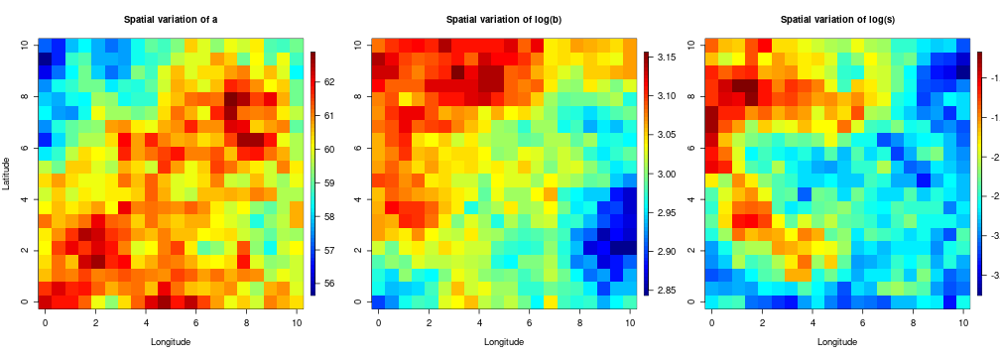
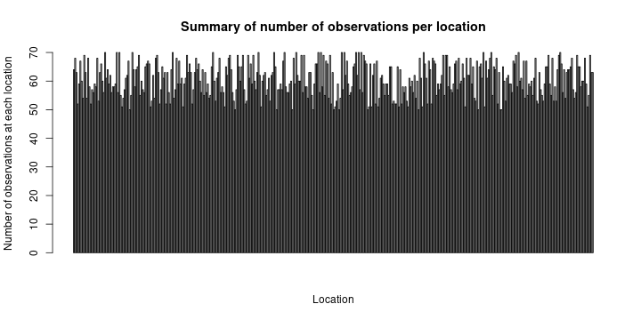
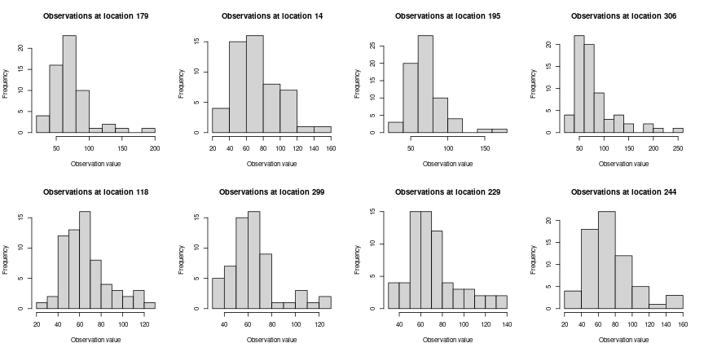
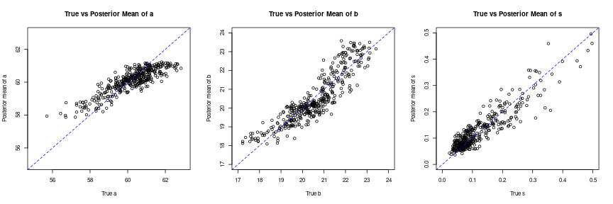
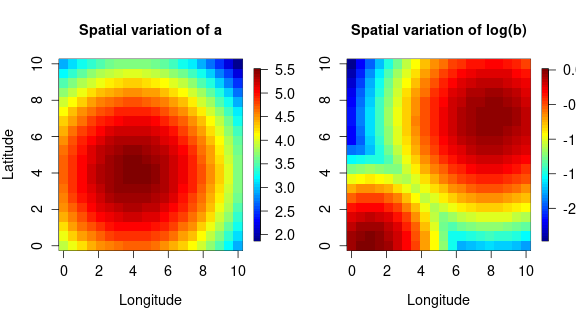
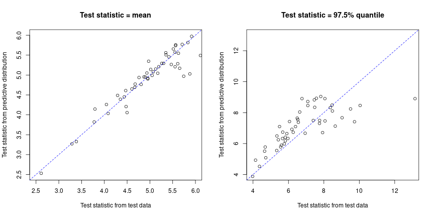
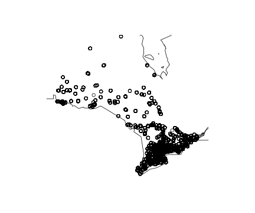
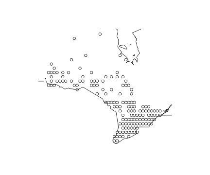
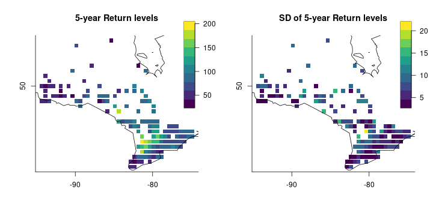
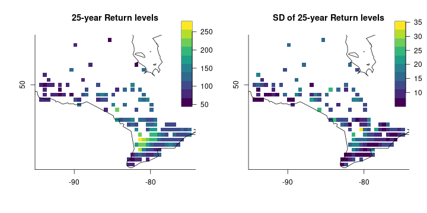

<script type="text/x-mathjax-config">
MathJax.Hub.Config({
  TeX: { equationNumbers: { autoNumber: "AMS" } }
});
</script>

\newcommand{\bm}[1]{\boldsymbol{#1}}
\newcommand{\tx}[1]{\mathrm{#1}}
\newcommand{\xx}{{\bm{x}}}
\newcommand{\yy}{{\bm{y}}}
\newcommand{\XX}{{\bm{X}}}
\newcommand{\YY}{{\bm{Y}}}
\newcommand{\ZZ}{{\bm{Z}}}
\newcommand{\tth}{{\bm{\theta}}}
\newcommand{\pps}{{\bm{\psi}}}
\newcommand{\uu}{{\bm{u}}}
\newcommand{\SSi}{{\bm{\Sigma}}}
\newcommand{\VV}{{\bm{V}}}
\newcommand{\iid}{{\overset{iid}{\sim}}}
\newcommand{\ind}{{\overset{ind}{\sim}}}
\newcommand{\cov}{{\tx{Cov}}}


## Introduction to the GEV-GP Model
The generalized extreme value (GEV) distribution is often used to analyze sequences of maxima within non-overlapping time periods. An example of this type of data is the monthly maximum rainfall levels recorded over years at a weather station. Since there are typically a large number of weather stations within a country or a state, it is more ideal to have a model that can borrow information from nearby weather stations to increase inference and prediction accuracy. Such spatial information is often pooled using the Gaussian process.

The GEV-GP model is a hierarchical model with a data layer and a spatial random effects layer. Let $\xx_1, \ldots, \xx_n \in \mathbb{R}^2$ denote the geographical coordinates of $n$ locations, and let $y_{ik}$ denote the extreme value measurement $k$ at location $i$, for $k = 1, \ldots, n_i$. The data layer specifies that each observation $y_{ik}$ has a generalized extreme value distribution, denoted by $y \sim \tx{GEV}(a, b, s)$, whose CDF is given by
\begin{equation}
    F(y\mid a, b, s) =
    \begin{cases}
    \exp\left\{-\left(1+s\frac{y-a}{b}\right)^{-\frac{1}{s}}\right\} \ \ &s\neq 0,\\
    \exp\left\{-\exp\left(-\frac{y-a}{b}\right)\right\} \ \ &s=0,
    \end{cases} 
\label{eqn:gev-distn}
\end{equation} 
where $a\in\mathbb{R}$, $b>0$, and $s\in\mathbb{R}$ are location, scale, and shape parameters, respectively. The support of the GEV distribution depends on the parameter values: $y$ is bounded below by $a-b/s$ when $s>0$, bounded above by $a-b/s$ when $s<0$, and unbounded when $s=0$. To capture the spatial dependence in the data, we assume some or all of the GEV parameters in the data layer are spatially varying. Thus they are introduced as random effects in the model. 

A Gaussian process $z(\xx)\sim \mathcal{GP}(\mu(\xx_{cov}), k(\xx, \xx'))$ is fully characterized by its mean $\mu(\xx_{cov})$ and kernel function $k(\xx, \xx') = \cov( z(\xx), z(\xx') )$, which captures the strength of the spatial correlation between locations. The mean is a function of parameters $\bm{\beta}$ and covariates $\xx_{cov}=(x_1,\ldots,x_p)'$. We assume that given the locations, the data follow independent GEV distributions each with their own parameters. The complete GEV-GP hierarchical model then becomes
\begin{equation}
\begin{aligned}
y_{ik} \mid a(\xx_i), b(\xx_i), s & \ind \tx{GEV}\big( a(\xx_i), \exp( b(\xx_i) ), \exp(s)\big)\\
a(\xx) \mid \bm{\beta}_a, \tth_a &\sim \mathcal{GP}\big( \XX_a\bm{\beta}_a, k(\xx, \xx' \mid \tth_a) \big)\\
log(b)(\xx) \mid \bm{\beta}_b, \tth_b &\sim \mathcal{GP}\big( \XX_b\bm{\beta}_b, k(\xx, \xx' \mid \tth_b) \big)\\
s(\xx) \mid \bm{\beta}_s, \tth_s &\sim \mathcal{GP}\big( \XX_s\bm{\beta}_s, k(\xx, \xx' \mid \tth_a) \big).
\end{aligned}
\end{equation}
In this package, a uniform prior $\pi(\tth) \propto 1$ is specified on the fixed effect and hyperparameters 
\[\tth=(s, \bm{\beta}_a, \bm{\beta}_b, \bm{\beta}_s, \tth_a, \tth_b, \tth_s).\] 

## What Does ***SpatialGEV*** Do?
The package provides an interface to estimate the approximate joint posterior distribution of the spatial random effects $a$, $b$ and $s$ in the GEV-GP model. The main functionalities of the package are:

- Method to fit the GEV-GP model and sample from the approximate joint posterior distribution of $a$, $b$ and $s$

- Method to sample from the posterior predictive distributions $p(\yy_{\tx{new}} \mid \yy_{\tx{observed}})$ at new locations

Details about the approximate posterior inference can be found in @chen-etal21.

## Installation
***SpatialGEV*** depends on the package [***TMB***](https://github.com/kaskr/adcomp) to perform the Laplace approximation. Make sure you have ***TMB*** installed following their [instruction](https://github.com/kaskr/adcomp/wiki/Download) before installing ***SpatialGEV***. Moreover, ***SpatialGEV*** uses several functions from the ***INLA*** package for approximating the Matérn covariance with the SPDE representation and for creating meshes on the spatial domain. If the user would like to use the SPDE approximation, please first install ***INLA***. Since ***INLA*** is not on CRAN, it needs to be downloaded following their instruction [here](https://www.r-inla.org/download-install). 

To install the latest version of ***SpatialGEV***, run the following:

```r
devtools::install_github("meixichen/SpatialGEV")
```

## Using the ***SpatialGEV*** Package

### Exploratory analysis
We now demonstrate how to use this package through a simulation study. The simulated data used in this example comes with the package as a list variable `simulatedData2`, which contains the following:

- `locs`: A $400\times 2$ data frame of spatial coordinates (longitudes and latitudes)

- `a`: A length $400$ vector of the true values of $a_i, \ i = 1,\ldots,400$ at the 400 locations

- `logb`: A length $400$ vector of the true values of log-transformed $b_i, \ i=1,\ldots,400$ at the 400 locations 

- `logs`: A length $400$ vector of the true values of log-transformed $s_i, \ i=1,\ldots,400$ at the 400 locations 

`a`, `logb` and `logs` are simulated from Gaussian random fields using the R package ***SpatialExtremes***. Using the simulated GEV parameters, we generate 50 to 70 observed data $\yy_i$ at each location $i, \ i=1,\ldots,400$. 

```r
library(SpatialGEV)
library(fields) # for plots
library(evd) # for rgev() and qgev()
source("vignette-helper-functions.R")
set.seed(123)
a <- simulatedData2$a
logb <- simulatedData2$logb
logs <- simulatedData2$logs
locs <- simulatedData2$locs
n_loc <- nrow(locs)
y <- Map(rgev, n=sample(50:70, n_loc, replace=TRUE),
         loc=a, scale=exp(logb), shape=exp(logs))
```

Spatial variation of $a$, $\log(b)$ and $\log(s)$ can be viewed by plotting them on regular lattices:

```r
par(mfrow=c(1,3))
grid_plot(unique(locs$x), unique(locs$y), matrix(a, ncol=sqrt(n_loc)), 
          "Spatial variation of a")
grid_plot(unique(locs$x), unique(locs$y), matrix(logb, ncol=sqrt(n_loc)),  
          "Spatial variation of log(b)", y_lab="")
grid_plot(unique(locs$x), unique(locs$y), matrix(logs, ncol=sqrt(n_loc)), 
          "Spatial variation of log(s)", y_lab="")
```



Number of observations at each location is shown in the figure below.

```r
barplot(sapply(y, length), 
        xlab = "Location", ylab = "Number of observations at each location",
        main = "Summary of number of observations per location")
```



Below are histograms of observations at $8$ randomly sampled locations.

```r
set.seed(123)
n_sam <-8
sam_inds <- sample(1:n_loc, n_sam, replace=FALSE)
par(mfrow=c(2, n_sam/2))
for (i in sam_inds){
  obs_i <- y[[i]]
  hist(obs_i, breaks=8,
       xlab="Observation value", main=paste("Observations at location", i))
}
```



### Model fitting
The function `spatialGEV_fit()` in the **SpatialGEV** package is used to find the mode and quadrature of the Laplace approximation to the marginal hyperparameter posterior, which is the basis of a Normal approximation to the posterior of both hyperparameters and random effects referred to as Laplace-MQ in our paper. The function `spatialGEV_sample()` is then used to sample from this distribution via a sparse representation of its precision matrix. 

To fit the GEV-GP model to this simulated dataset, the first step is calling the `spatialGEV_fit()` function, for which several arguments must be provided:

- `data`: A list of $n$ vectors, each of which contains all data collected at one location.

- `locs`: A $n \times 2$ coordinate matrix.

- `random`: A character string indicating which GEV parameters are treated as spatial random effects. It can be one of "a", "ab", and "abs", where "a", "b", and "s" represent the GEV location, scale, and shape parameters, respectively. Note that in the model $b$ is always estimated on the log scale since it is constrained to be positive.

- `init_param`: A list of initial parameters to be passed to the optimizer. Call `?spatialGEV_fit()` and see Details for which parameters need to be included in the list.

- `reparam_s`: A flag for reparametrizing the GEV shape parameter $s$ - either "zero", "unconstrained", "negative", or "positive". For example, if `reparam_s = "positive"`, the model works with the log-transformed shape parameter. Call `?spatialGEV_fit()` and see Details for more information about this argument. 

There are other arguments which user might want to specify to override the defaults:

- `method`: A character string "laplace" (default) or "maxsmooth". The former corresponds to the main Laplace method described in @chen-etal21. The latter corresponds to a more computationally efficient but possibly less accurate two-step method known as *Max-and-Smooth* [@hrafnkelsson-etal19]. Details on the Max-and-Smooth approach for fitting a GEV-GP model can be found in  @@jhannesson-etal22.

- `kernel`: The kernel used for the Gaussian process(es) describing the spatial random effect(s). Currently 3 kernels are implemented: the exponential kernel (`kernel="exp"`), the Matérn kernel (`kernel="matern"`), and the SPDE approximation to the Matérn kernel (`kernel="spde"`) based on @lindgren-etal11 (the default choice). The latter provides most computationally efficient estimation of the GEV parameters by approximating the spatial GPs using basis expansion.

- `X_a`, `X_b`, `X_s`: Design matrices of covariates for the spatial random effects "a", "b", and "s". The defaults are column matrices of $1$s, i.e., only an intercept parameter $\beta_0$ will be estimated for each spatial random effect.

- `s_prior`: A vector $(\mu, \sigma)$. Optionally a normal prior with parameters $(\mu, \sigma)$ can be specified on the fixed effect shape parameter $s$, or its reparametrized version depending on the value of `reparam_s`. When `s_prior` is not specified, a uniform prior is used. 

- `beta_prior`: A named list of length-2 vectors $(\mu, \sigma)$. Optionally normal priors $\mathcal{N}(\mu, \sigma^2)$ can be put on the regression coefficients $\bm{\beta}$ for the random effects. To specify a normal prior on a random effect, name the vector `beta_a` or `beta_b` or `beta_s`. E.g., `beta_prior=list(beta_a=c(0, 100))` puts a $\mathcal{N}(0,100)$ prior on $a$. When `beta_prior` is not specified, uniform priors are applied.

- `matern_pc_prior`: A named list with elements provided using the `matern_pc_prior()` function. Optionally penalized complexity priors can be put on the Matérn covariance hyperparameters. See `?matern_pc_prior()` for more details.

- `return_levels`: A numeric vector containing numbers $p_1, \ldots, p_k \in (0, 1)$. This tells the model to also return the $p_1,\ldots, p_k$% quantiles at each location.

The code below fits a GEV-GP model with Matérn SPDE kernel to the simulated data. The shape parameter is constrained to be positive. No covariates are included in this model, so by default an intercept parameter $\beta_0$ is estimated for the GP of each spatial random effect. We also specify the return levels of interest at 0.5 and 0.9.


```r
fit <- spatialGEV_fit(data = y, locs = locs, random = "abs",
                      init_param = list(a = rep(60, n_loc),
                                        log_b = rep(2,n_loc),
                                        s = rep(-3,n_loc),
                                        beta_a = 60, beta_b = 2, beta_s = -2,
                                        log_sigma_a = 1.5, log_kappa_a = -2,
                                        log_sigma_b = 1.5, log_kappa_b = -2,
                                        log_sigma_s = -1, log_kappa_s = -2),
                      reparam_s = "positive", kernel="spde", 
                      return_levels = c(0.5, 0.9),
                      silent = TRUE)
```


```r
class(fit)
#> [1] "spatialGEVfit"
print(fit)
#> Model fitting took 247.961340665817 seconds 
#> The model has reached relative convergence 
#> The model uses a spde kernel 
#> Number of fixed effects in the model is 9 
#> Number of random effects in the model is 1308 
#> Hessian matrix is positive definite. Use spatialGEV_sample to obtain posterior samples
```

The point estimates and the associated standard errors (calculated via the Delta method) for the first 5 locations can be obtained as follows.

```r
fit_summary <- summary(fit)
fit_summary$return_levels[1:5,]
#>               Estimate0.5 Estimate0.9 Std.Error0.5 Std.Error0.9
#> return_levels    68.26723    107.7014    0.9652088     2.683339
#> return_levels    68.27546    108.3477    0.8641505     2.475383
#> return_levels    68.27882    109.1868    0.7956246     2.384804
#> return_levels    68.23156    109.5912    0.7829240     2.396303
#> return_levels    68.16005    109.5361    0.7952542     2.161209
```

### Posterior sampling
To obtain posterior samples of $a$, $b$, and $s$, we pass the fitted model object `fit` to `spatialGEV_sample()`, which takes in three arguments:

- `model`: An object of class `spatialGEVfit`, which is the output of `spatialGEV_fit()`.

- `n_draw`: Number of samples to draw from the posterior distribution $p(a, b, s \mid \YY, \XX)$.

- `observation`: If set to `TRUE`, the function will also draw from the posterior predictive distribution $p(y^{\tx{rep}} \mid \YY)$ at the observed locations. This is useful for Bayesian model checking, which we will demonstrate shortly. 

- `loc_ind`: A vector of location indices at which samples will be drawn. Default is all locations.

The following line of code draws 2000 samples from the posterior distribution and the posterior predictive distribution:

```r
sam <- spatialGEV_sample(model = fit, n_draw = 2000, observation = TRUE)
print(sam)
#> The samples contains 2000 draws of 1209 parameters 
#> The samples contains 2000 draws of response at 400 locations 
#> Use summary() to obtain summary statistics of the samples
```

Then use `summary()` to view the summary statistics of the posterior samples.

```r
pos_summary <- summary(sam)
pos_summary$param_summary[c(1:5, 
                            (n_loc+1):(n_loc+5), 
                            (2*n_loc+1):(2*n_loc+5),
                            (3*n_loc):(nrow(pos_summary$param_summary))),]
#>                  2.5%        25%        50%        75%       97.5%       mean
#> a1          59.412539 60.5606787 61.1760198 61.7450187 62.81015397 61.1426639
#> a2          59.539727 60.5454594 61.0884820 61.6491748 62.55328984 61.0895984
#> a3          59.581149 60.5069739 61.0161594 61.4839396 62.34364563 60.9965115
#> a4          59.513730 60.4250367 60.8875294 61.3477945 62.33539179 60.8892916
#> a5          59.296019 60.2661151 60.7286919 61.2282584 62.15330084 60.7418139
#> log_b1       2.877005  2.9294962  2.9567235  2.9825525  3.03232503  2.9561419
#> log_b2       2.893010  2.9397056  2.9636650  2.9864951  3.03059358  2.9627034
#> log_b3       2.915094  2.9525660  2.9739638  2.9940322  3.03259781  2.9734103
#> log_b4       2.924364  2.9631214  2.9819243  3.0019072  3.03939871  2.9822945
#> log_b5       2.939242  2.9758818  2.9943037  3.0133760  3.04701306  2.9940867
#> s1          -3.839856 -3.0841189 -2.7307542 -2.3706166 -1.65738654 -2.7388903
#> s2          -3.573531 -2.9649495 -2.6447043 -2.3158603 -1.72693538 -2.6423994
#> s3          -3.389748 -2.8394872 -2.5343934 -2.2401899 -1.68024250 -2.5359593
#> s4          -3.360504 -2.8003850 -2.5143843 -2.2420109 -1.63099629 -2.5115080
#> s5          -3.344200 -2.8611489 -2.6160538 -2.3815445 -1.84034036 -2.6154145
#> s400        -4.414861 -3.6845410 -3.3234348 -2.9691244 -2.23024853 -3.3197572
#> beta_a      59.254986 59.8170439 60.1140164 60.3904082 60.97734166 60.1139866
#> beta_b       2.930002  2.9900897  3.0248382  3.0565364  3.11982666  3.0233803
#> beta_s      -2.815150 -2.5094988 -2.3405593 -2.1767840 -1.86375833 -2.3421628
#> log_sigma_a -2.168320 -1.3661709 -0.9866477 -0.6044773  0.05501866 -0.9967687
#> log_kappa_a -1.448783 -0.8093071 -0.4702390 -0.1377747  0.55418411 -0.4640518
#> log_sigma_b -4.298673 -3.5310981 -3.0931269 -2.6657391 -1.87501163 -3.0952154
#> log_kappa_b -2.002020 -1.4089644 -1.0952879 -0.7842804 -0.19887461 -1.0943473
#> log_sigma_s -2.305678 -1.8257401 -1.5657913 -1.3120916 -0.85406613 -1.5674691
#> log_kappa_s -0.830086 -0.5131705 -0.3312056 -0.1599720  0.17159183 -0.3330161
pos_summary$y_summary[1:5,]
#>        2.5%      25%      50%      75%    97.5%     mean
#> y1 37.16310 55.05763 68.63354 85.51421 143.4623 73.74704
#> y2 35.63351 54.13532 67.33381 85.98369 137.5352 72.47793
#> y3 37.35344 54.85376 68.40772 85.42123 142.6234 73.70693
#> y4 36.04354 54.88409 67.70335 85.37151 142.4695 73.51183
#> y5 36.61537 54.21058 67.26347 87.65584 147.4782 74.02922
```

### Model checking
Since we know the true values of $a$, $b$, and $s$ in this simulation study, we are able to compare the posterior mean with the true values. The posterior means of $a$, $b$ and $s$ at different locations are plotted against the true values below.

```r
par(mfrow=c(1,3))
plot(a, pos_summary$param_summary[1:n_loc,"mean"], 
     xlim=c(55, 63), ylim=c(55,63),
     xlab="True a",
     ylab="Posterior mean of a",
     main="True vs Posterior Mean of a")
abline(0, 1, col="blue", lty="dashed")
plot(exp(logb), exp(pos_summary$param_summary[(n_loc+1):(2*n_loc),"mean"]), 
     xlim=c(17, 24), ylim=c(17, 24),
     xlab="True b",
     ylab="Posterior mean of b",
     main="True vs Posterior Mean of b")
abline(0, 1, col="blue", lty="dashed")
plot(exp(logs), exp(pos_summary$param_summary[(2*n_loc+1):(3*n_loc),"mean"]), 
     xlim=c(0, 0.5), ylim=c(0, 0.5),
     xlab="True s",
     ylab="Posterior mean of s",
     main="True vs Posterior Mean of s")
abline(0, 1, col="blue", lty="dashed")
```



### Posterior prediction
Finally, we demonstrate how to make predictions at new locations. This is done using the `spatialGEV_predict()` function, which takes the following arguments:

- `model`: An object of class `spatialGEVfit`, which is the output of `spatialGEV_fit()`.

- `locs_new`: An $m \times 2$ matrix of the coordinates of the $m$ test locations.

- `n_draw`: Number of samples to draw from the posterior predictive distribution $p(\YY^{\tx{new}} \mid \YY)$.

- `X_a_new`, `X_b_new`, `X_s_new`: Design matrices for the spatial random effects. Need to be provided here if design matrices were used in model fitting.

- `parameter_draws`: An optional `n_draws x n_parameters` matrix that contains the posterior samples of all parameters. If `spatialGEV_sample()` has already been called prior to `spatialGEV_predict()`, its output can be provided to the prediction function to save time.

In this dataset, the GEV parameters $a$ and $\log(b)$ are generated from the surfaces below, and the shape parameter is a constant $\exp(-2)$ across space.

```r
a <- simulatedData$a
logb <- simulatedData$logb
logs <- simulatedData$logs
y <- simulatedData$y
locs <- simulatedData$locs
n_loc <- nrow(locs)
par(mfrow=c(1,2))
grid_plot(unique(locs$x), unique(locs$y), matrix(a, ncol=sqrt(n_loc)), 
          "Spatial variation of a")
grid_plot(unique(locs$x), unique(locs$y), matrix(logb, ncol=sqrt(n_loc)), 
          "Spatial variation of log(b)", y_lab="")
```



We randomly sample 100 locations from the simulated dataset `simulatedData` as test locations which are left out. Data from the rest 300 training locations are used for model fitting. We fit a GEV-GP model with random $a$ and $b$ and log-transformed $s$ to the training dataset. The kernel used here is the SPDE approximation to the Matérn covariance function (@lindgren-etal11).

```r
set.seed(123)
n_test <- 50
n_train <- n_loc - n_test
test_ind <- sample(1:n_loc, n_test)
train_ind <- setdiff(1:n_loc, test_ind)
# Obtain coordinate matrices and data lists
locs_test <- locs[test_ind,]
y_test <- y[test_ind]
locs_train <- locs[-test_ind,]
y_train <- y[-test_ind]

# Fit the GEV-GP model to the training set
train_fit_s <- spatialGEV_fit(data =y_train, locs = locs_train, random = "ab",
                      init_param = list(a = rep(0, n_train),
                                        log_b = rep(0,n_train), s = 0,
                                        beta_a = 0, beta_b = 0,
                                        log_sigma_a = 1, log_kappa_a = -2,
                                        log_sigma_b = 1, log_kappa_b = -2),
                      reparam_s = "positive", kernel="spde", silent = TRUE)
```

The fitted model object is passed to `spatialGEV_predict()` for 500 samples from the posterior predictive distributions. Note that this might take some time.

```r
pred_s <- spatialGEV_predict(model = train_fit_s, locs_new = locs_test, n_draw = 500)
pred_s
#> 500 posterior predictive samples have been draw for 50 test locations
#> The number of training locations is 350 
#> Use summary() to obtain summary statistics of the posterior predictive samples
```

Then we call `summary()` on the `pred` object to obtain summary statistics of the posterior predictive samples at the test locations.

```r
pred_summary <- summary(pred_s)
pred_summary[1:5,]
#>          2.5%      25%      50%      75%    97.5%     mean
#> [1,] 3.173797 3.776733 4.253143 5.005201 7.099204 4.488024
#> [2,] 3.960440 4.207681 4.347495 4.533580 5.082605 4.391411
#> [3,] 3.954970 4.588568 5.115920 5.925390 8.823935 5.456058
#> [4,] 4.157286 4.551524 4.834966 5.191469 6.330970 4.937432
#> [5,] 3.562145 4.076009 4.424296 5.015538 6.921266 4.649308
```

Since we have the true observations at the test locations, we can compare summary statistics of the true observations to those of the posterior predictive distributions. In the figures below, each circle represents a test location.

```r
par(mfrow=c(1,2))
plot(sapply(y_test, mean), pred_summary[,"mean"], 
     xlim=c(2.5, 6), ylim=c(2.5, 6),
     xlab="Test statistic from test data",
     ylab="Test statistic from predictive distribution",
     main="Test statistic = mean")
abline(0, 1, col="blue", lty="dashed")
plot(sapply(y_test, function(x){quantile(x, probs=0.975)}), pred_summary[,"97.5%"], 
     xlim=c(4, 13), ylim=c(4, 13),
     xlab="Test statistic from test data",
     ylab="Test statistic from predictive distribution",
     main="Test statistic = 97.5% quantile")
abline(0, 1, col="blue", lty="dashed")
```



## Case study: Yearly maximum snowfall data in Ontario, Canada
In this section, we show how to use the ***SpatialGEV*** package to analyze a real dataset. The data used here are the 1987-2021 monthly total snowfall data (in cm) obtained from Environment and Natural Resources, Government of Canada. The link to download the raw data is https://climate-change.canada.ca/climate-data/#/monthly-climate-summaries. This dataset is automatically loaded with the package and is named `ONsnow`.

```r
library(dplyr)
#library(maps)
lon_range <- c(-96, -73)
lat_range <-  c(41.5, 55)
summary(ONsnow)
#>     LATITUDE       LONGITUDE      STATION_NAME       CLIMATE_IDENTIFIER   LOCAL_YEAR    LOCAL_MONTH     TOTAL_SNOWFALL  
#>  Min.   :41.75   Min.   :-94.62   Length:63945       Length:63945       Min.   :1987   Min.   : 1.000   Min.   :  0.00  
#>  1st Qu.:43.58   1st Qu.:-81.50   Class :character   Class :character   1st Qu.:1991   1st Qu.: 3.000   1st Qu.:  0.00  
#>  Median :44.23   Median :-79.93   Mode  :character   Mode  :character   Median :1997   Median : 6.000   Median :  1.00  
#>  Mean   :44.96   Mean   :-80.88                                         Mean   :1999   Mean   : 6.469   Mean   : 15.23  
#>  3rd Qu.:45.50   3rd Qu.:-78.97                                         3rd Qu.:2005   3rd Qu.: 9.000   3rd Qu.: 23.60  
#>  Max.   :54.98   Max.   :-74.47                                         Max.   :2021   Max.   :12.000   Max.   :326.00
maps::map(xlim = lon_range, ylim = lat_range)
points(ONsnow$LONGITUDE, ONsnow$LATITUDE)
```



### Data preprocessing
We first grid the data using cells of length $0.5^{\circ}$. By doing this, weather stations that are apart by less than $0.5^{\circ}$ in longitude/latitude are grouped together in the same grid cell. From now on, we refer to each grid cell as a location.

```r
grid_locs <- grid_location(ONsnow$LONGITUDE, ONsnow$LATITUDE,
                           sp.resolution = 0.5)
data_grid <- cbind(grid_locs, ONsnow)
data_grid[1:5,]
#>   cell_ind cell_lon cell_lat LATITUDE LONGITUDE   STATION_NAME CLIMATE_IDENTIFIER LOCAL_YEAR LOCAL_MONTH TOTAL_SNOWFALL
#> 1      259  -89.867       54   53.833   -89.867 BIG TROUT LAKE            6010738       1987           1           33.6
#> 2      259  -89.867       54   53.833   -89.867 BIG TROUT LAKE            6010738       1987           2           33.6
#> 3      259  -89.867       54   53.833   -89.867 BIG TROUT LAKE            6010738       1987           3           19.8
#> 4      259  -89.867       54   53.833   -89.867 BIG TROUT LAKE            6010738       1987           4            5.6
#> 5      259  -89.867       54   53.833   -89.867 BIG TROUT LAKE            6010738       1987           5           12.8
```

For each location, we find the maximum snowfall amount each year and only keep locations where there are at least two years of records.

```r
# Yearly max for each location
all_locs <- data_grid %>% 
  select(cell_ind, cell_lon, cell_lat) %>%
  distinct() 
yearly_max_records <- data_grid %>% 
  group_by(cell_ind, LOCAL_YEAR) %>% 
  slice(which.max(TOTAL_SNOWFALL)) %>%
  select(cell_ind, LOCAL_YEAR, LOCAL_MONTH, TOTAL_SNOWFALL) %>% 
  rename(YEARLY_MAX_SNOWFALL = TOTAL_SNOWFALL) %>%
  filter(YEARLY_MAX_SNOWFALL > 0) %>% # Remove records of 0s 
  left_join(all_locs, by="cell_ind")

# Coordinates of the locations
locs <- yearly_max_records %>% ungroup() %>% 
  select(cell_ind, cell_lon, cell_lat) %>% 
  distinct()
n_loc <- nrow(locs)

# Make data into a list in which each vector contains data from one location
Y <- vector(mode="list", length=n_loc)
for (i in 1:n_loc){
  id <- locs$cell_ind[i]
  Y[[i]] <- yearly_max_records %>% 
    ungroup() %>%
    filter(cell_ind==id) %>% 
    pull(YEARLY_MAX_SNOWFALL)
}

# Only keep locations with at least 2 years of records
chosen_loc_ind <- which(sapply(Y, length) >= 2)
Y <- Y[chosen_loc_ind]
locs <- locs %>% select(cell_lon, cell_lat) %>% slice(chosen_loc_ind)
n_loc <- nrow(locs)
```


```r
maps::map(xlim = lon_range, ylim = lat_range)
points(locs$cell_lon, locs$cell_lat)
```



Now we fit the GEV-GP model to the data using the SPDE kernel. Both $a$ and $b$ are treated as spatial random effects. $s$ is constrained to be a positive constant. Note that here we have specified a $\mathcal{N}(-5,5)$ prior on the log-transformed shape parameter. This is because we found that the shape parameter is estimated close to 0 and such a prior ensures model fitting procedure is numerically stable.

```r
fit <- spatialGEV_fit(Y, locs, random="ab",
                      init_param = list(a=rep(55, n_loc),
                                        log_b=rep(3, n_loc),
                                        s=-5,
                                        beta_a=55, beta_b=3,
                                        log_sigma_a=6, log_kappa_a=1,
                                        log_sigma_b=0, log_kappa_b=1),
                      reparam_s="positive",
                      kernel="spde", 
                      s_prior=c(-5,5),
                      silent=TRUE)
fit
#> Model fitting took 23.0775389671326 seconds 
#> The model has reached relative convergence 
#> The model uses a spde kernel 
#> Number of fixed effects in the model is 7 
#> Number of random effects in the model is 542 
#> Hessian matrix is positive definite. Use spatialGEV_sample to obtain posterior samples
```

Next, 5000 samples are drawn from the joint posterior distribution of all parameters. 

```r
sam <- spatialGEV_sample(fit, n_draw=5000, observation=F)
```

Instead of using the `return_levels` argument in `spatialGEV_fit()`, we can also use the posterior samples to calculate the 5-year, 10-year, and 25-year return level posterior samples, which are the upper $1/5$%, $1/10$%, and $1/25$% quantiles of the extreme value distributions at these locations.

```r
#library(evd)
p_draws <- sam$parameter_draws
# Get indices of each GEV parameter in the sample matrix
a_ind <- which(colnames(p_draws)%in% paste0("a", 1:n_loc))
logb_ind <- which(colnames(p_draws)%in% paste0("log_b", 1:n_loc))
logs_ind <- which(colnames(p_draws) == "s")

# Deine a function to draw from the return level posterior distribution
rl_draw <- function(return_period){
  apply(p_draws, 1,
               function(all_draw){
                 mapply(evd::qgev, p=1/return_period, 
                        loc=all_draw[a_ind], 
                        scale=exp(all_draw[logb_ind]),
                        shape=exp(all_draw[logs_ind]), lower.tail=F)
        })
}

# 5 year return-level
q5_draws <- rl_draw(5)
return5 <- apply(q5_draws, 1, mean)
return5sd <- apply(q5_draws, 1, sd)
# 25 year return-level
q25_draws <- rl_draw(25)
return25 <- apply(q25_draws, 1, mean)
return25sd <- apply(q25_draws, 1, sd)
```

Plotted below are the return levels.

```r
par(mfrow=c(1,2))
map_plot(return5, title="5-year Return levels")
map_plot(return5sd, title="SD of 5-year Return levels")
```



```r
map_plot(return25, title="25-year Return levels")
map_plot(return25sd, title="SD of 25-year Return levels")
```



## References
